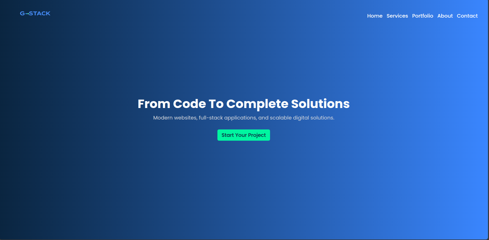
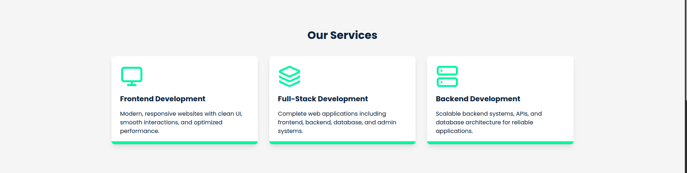
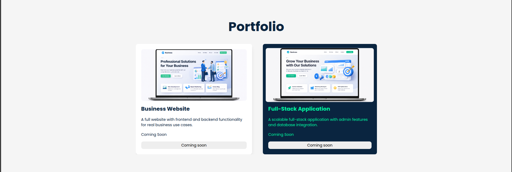
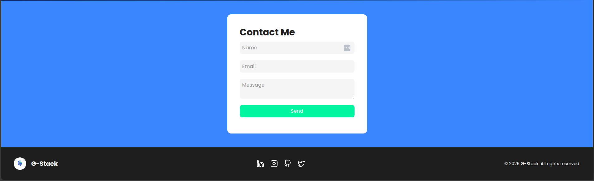

# 🚀 G-Stack Landing Page

**From Code to Complete Solutions**

A modern, responsive landing page built for **G-Stack**, showcasing web development services and clean UI design. This project represents a professional frontend implementation focused on performance, responsiveness, and user experience.

---

## 🌐 Overview

This landing page is designed to present G-Stack as a digital solutions brand, highlighting services, portfolio, and contact options in a clean and engaging layout.

---

## ✨ Features

- 🔹 Modern Hero Section with gradient background and CTA
- 🔹 Services section (Frontend, Backend, Full-Stack)
- 🔹 Portfolio showcase layout
- 🔹 About section with personal branding
- 🔹 Contact form UI
- 🔹 Fully responsive design (mobile, tablet, desktop)
- 🔹 Clean and minimal UI/UX

---

## 🛠 Tech Stack

- **Frontend:** React (or HTML/CSS/JS if applicable)
- **Styling:** CSS3 / Tailwind CSS (update if needed)
- **Fonts:** Poppins & Inter
- **Deployment:** Vercel / Netlify

---

## 🎨 Design System

- **Primary Color:** #0A2540 (Deep Navy)
- **Secondary Color:** #3A86FF (Electric Blue)
- **Accent Color:** #00F5A0 (Neon Green)
- **Background:** #F5F5F5 (Light Gray)
- **Typography:** Modern, clean, tech-focused

---

## 📸 Screenshots

- Hero Section

- Services Section

- Portfolio Section

- Contact Section

---

## 🚀 Live Demo

👉 [View Live Project](YOUR_DEPLOYED_LINK)

---

## 📈 Purpose

This project is part of my portfolio to demonstrate:

- Frontend development skills
- UI/UX design understanding
- Clean code structure
- Real-world business landing page implementation

---

## 📩 Contact

**George — G-Stack**  
📧 george.gstack@gmail.com

---

## ⭐ Support

If you like this project, feel free to ⭐ the repository!

---

## 📌 License

This project is open-source and available under the MIT License.
